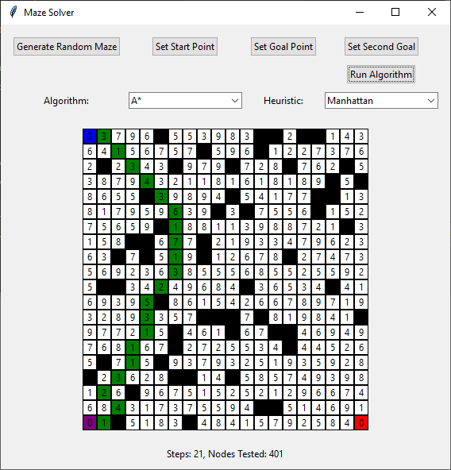
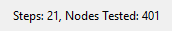

# Maze Solver and Generator

This project implements a graphical tool for generating and solving mazes using three fundamental search algorithms: **A\*** (A-Star Search), **Uniform Cost Search (UCS)**, and **Best-First Search (BFS)**. It provides a user-friendly **GUI** for generating, customizing, and solving mazes.

## Features

### Maze Generation
- Generate **random mazes** with walls and weighted paths.
- **Manually customize** mazes by adding walls, start points, and up to two goal points directly through the GUI.

### Maze Solving Algorithms
- **A\*** Search: Uses a combination of path cost and heuristic for optimal pathfinding.
- **Uniform Cost Search (UCS)**: Finds the least-cost path using only path cost.
- **Best-First Search (BFS)**: Prioritizes nodes with the lowest heuristic value.
- Selection between **Manhattan distance** and **Euclidean distance** as the heuristic.

### Visualization
- Display the **maze grid** with visual feedback for walls which is represented as "-1" in the code, start points, goals, and solution paths.
- Show the **number of steps** in the solution and the **number of nodes tested**.


## Installation

### Prerequisites
- `Python 3.7` or higher
- Required libraries: `tkinter`, `math`, `heapq`

### Setup
1. Clone the repository:
   ```bash
   git clone https://github.com/mkittani/Maze-Solver-and-Generator.git

2. Install libraries (if needed):
   ```bash
   pip install tk
## How to Use
1. Launch the program:
   ```bash
   python main.py
2. Use the buttons to:
   - Generate a random maze.
   - Set start and goal points manually by clicking on the labeled buttons then selecting any box.
   - Add walls by clicking on grid cells.
   - Choose an algorithm and heuristic.
3. Click Run Algorithm to solve the maze.
4. View the solution, steps, and nodes tested.
## Algorithms

### A* Search
Combines the path cost and heuristic to find the optimal path:
- **Total Cost**: `g(n) + h(n)`  
  where `g(n)` is the cost of the path from the start node to the current node, and `h(n)` is the estimated cost from the current node to the goal.  
- **Heuristic**: Can use either **Manhattan Distance** or **Euclidean Distance**.

### Uniform Cost Search (UCS)
Finds the path with the least total cost:
- **Total Cost**: `g(n)`  
  Expands nodes based solely on the accumulated path cost from the start.

### Best-First Search (BFS)
Prioritizes nodes based only on the heuristic value:
- **Priority**: `h(n)`  
  Focuses on the estimated cost from the current node to the goal.
## Example Output

- **Maze Grid**:  
  - Visual representation of the maze.  
  - Start point is displayed in **blue**.  
  - Goal points are shown in **red** or **purple** (if multiple goals are defined).  
  - **The solution path is highlighted in green**.
  - 

- **Stats**:  
  - Displays the **number of steps** required to reach the goal.  
  - Shows the **number of nodes tested** during the search.
  - 

## Authors
- [@mkittani](https://github.com/mkittani)
- [@MahmoudFarah003](https://github.com/MahmoudFarah003)

## Contributing
Feel free to contribute by opening an issue or submitting a pull request.
